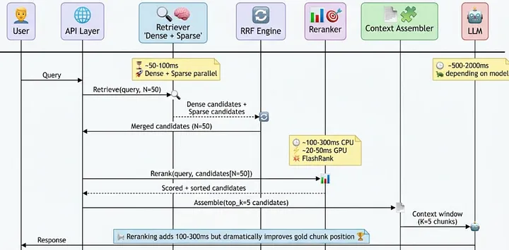
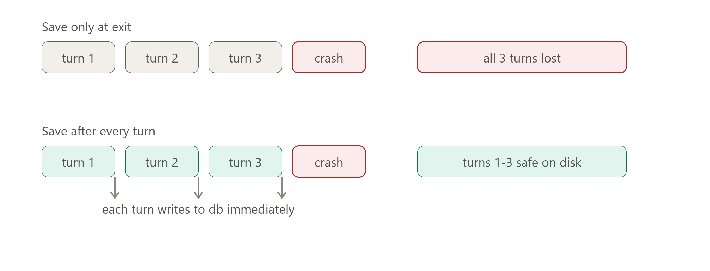

# problem faced with chunking

in chunking the bns the split was on the illustration or expliantion it made the chunks too smaller  like 2 sentence one sentece
# new apporch: 
     * check if tokens are 450 ? 
    if no :
        dont split
    if yes:
        check if the illustration or the explination contains? here? 
        yes then break on first coming and then make chunks
        done

# even reranker wasnt loading the correct top k ? i mean loading but not pure relevant
* tried approches:
    1) added the section title with the query:
        improved performance but didnt solved the problem

# chunking structure:
"I started with inconsistent per-source chunking logic, noticed it was creating brittle, hard-to-scale code, redesigned a uniform parent/child schema myself, and it let me collapse four embedding functions into one." That's a real engineering narrative, not a buzzword 

Refactor chunking pipeline to unified parent-child structure
to increase scalability or make it robust

- Update embedder to use a single embed_chunks() function for all
to make it easy to scale
Good line for your README/interview: "I evaluated reranker models on a time-vs-quality tradeoff using RAGAS context_precision across my golden dataset, and chose [X] because [reasoning]" — that's a substantive, defensible engineering decision, exactly the kind of story that separates you from someone who just picked whatever tutorial mentioned.

# GPU - CPU comparision for latency :
# this is example but compare actual for project and keep in project_md at last readme: file 

Yes, genuinely — GPU would be dramatically faster for this specific workload, and it's worth understanding why, not just "GPU = faster" as a blanket rule.
Why GPUs are so much faster for this specific case (cross-encoder inference):
Cross-encoder reranking is fundamentally a matrix multiplication-heavy workload — every forward pass through the transformer (attention layers, feed-forward layers) is dominated by large matrix multiplies. GPUs have thousands of small cores designed to do many matrix operations in parallel simultaneously, while CPUs have far fewer cores (typically 4-16) optimized for sequential, general-purpose work with some parallelism.
Concrete expectation for your case: the same MiniLM-L-6 rerank that took ~3 seconds for 50 pairs on CPU would likely run in under 100-200 milliseconds on even a modest GPU (like a free Colab/Kaggle T4) — often 15-30x faster for this kind of batched inference workload. This isn't a marginal improvement, it's a different performance tier entirely.
Why this matters specifically for reranking (batched, parallel-friendly) vs. something like your gradient descent loop (sequential, less parallel):
Reranking scores multiple (query, passage) pairs independently — pair 1's computation doesn't depend on pair 2's result. This is exactly the kind of "many independent parallel computations" workload GPUs excel at. Compare that to something inherently sequential (like your gradient descent loop, which needs each epoch's weights before computing the next) — GPUs help there too (matrix ops are still faster), but the speedup isn't as dramatic since there's less naturally parallel structure to exploit.
What this means practically for your project:

For portfolio/demo purposes right now: CPU is completely fine — 1-3 seconds for reranking is acceptable for a demo or interview walkthrough. Don't over-engineer this.
If you ever deploy for real users at scale: GPU inference (even a shared/cheap cloud GPU instance) would meaningfully improve response latency, especially if you're batching multiple users' reranking requests together.
Free options to test this yourself: Kaggle's free T4 GPU (which you already know about from earlier tonight) — you could literally run the same MiniLM-L-6 rerank there and see the actual speedup with your own eyes, which would also make a great "I benchmarked CPU vs GPU inference and got Nx speedup" data point for your README/interview story.

One more architecture nuance worth knowing for interviews: GPUs also have higher memory bandwidth than CPUs — feeding data (embeddings, weights) into the compute cores fast enough is often the actual bottleneck for large models, not the compute itself. GPUs are built with much wider memory buses specifically to keep those thousands of cores fed, which is part of why the gap is so large in practice, not just "more cores."
Bottom line: yes, GPU would meaningfully speed this up in production, CPU is fine for where you are right now (demo-stage project), and testing the actual CPU-vs-GPU speedup on Kaggle would be a genuinely good, cheap experiment to add real numbers to your project story.

# creat image like this for project

#  write the code for persistne memory and save the 

like this so we can use for auditable and all got it 